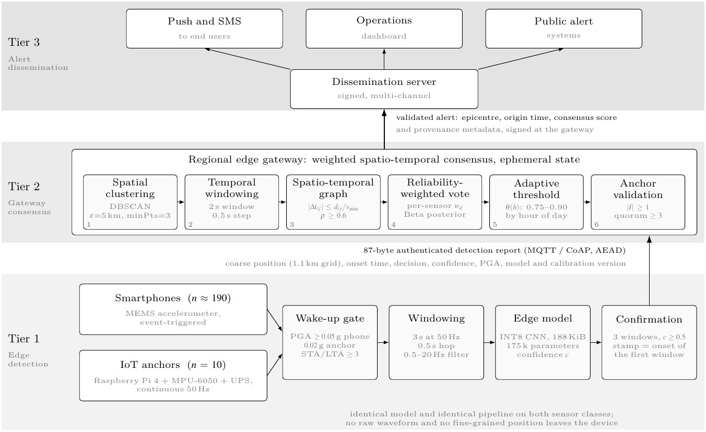
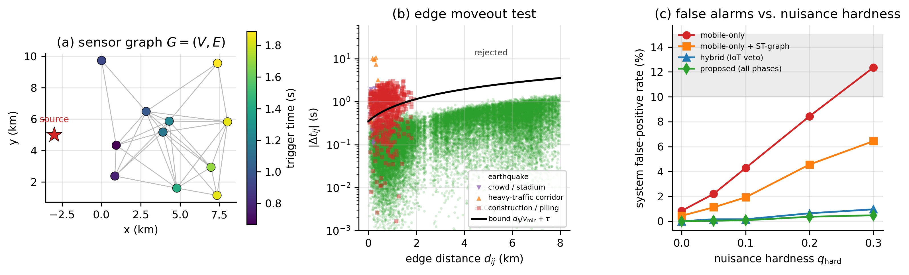
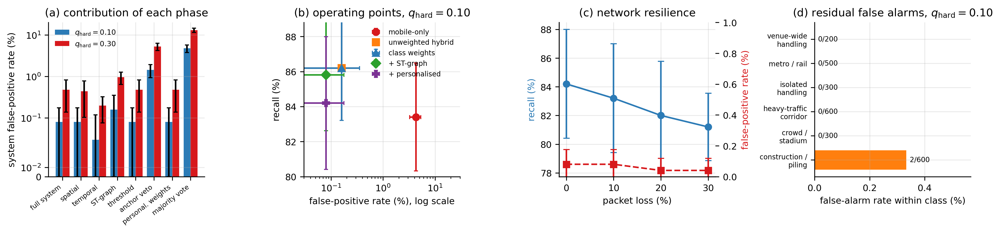
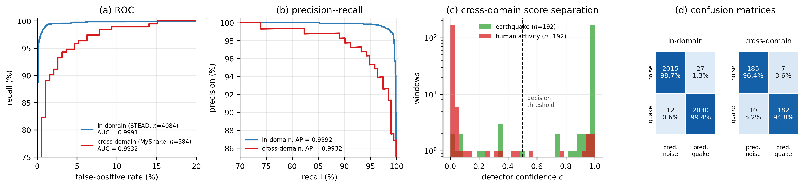
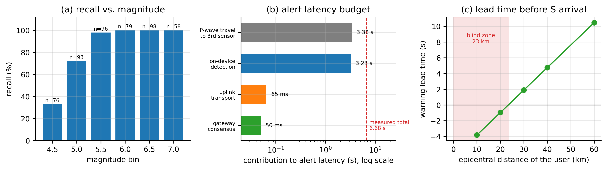
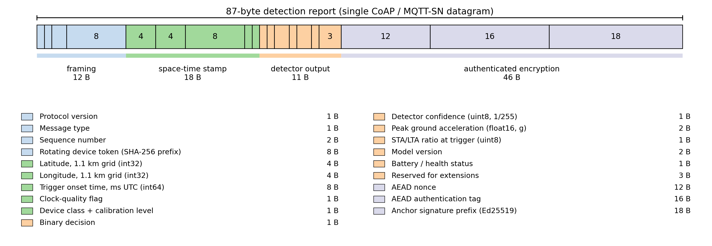
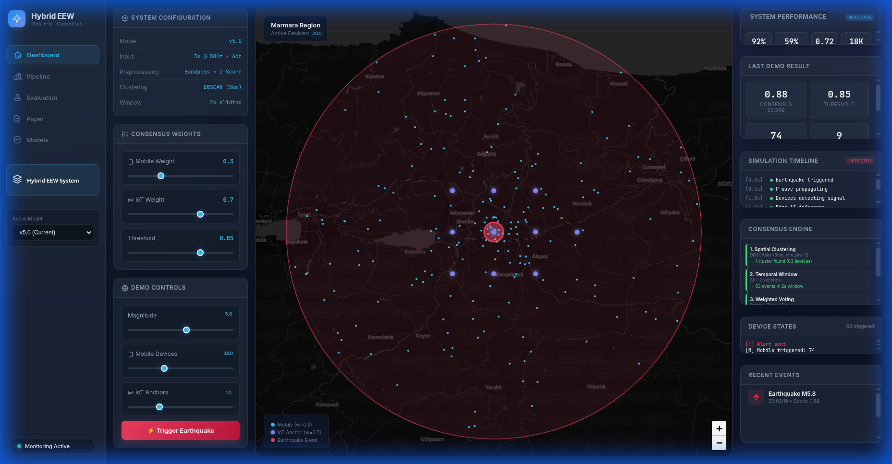

# Reducing False Alarms in Crowd-Sourced Earthquake Early Warning via Hybrid Edge Intelligence

[](https://www.python.org/)
[](https://www.tensorflow.org/)
[](LICENSE)
[](models/earthquake_detector.tflite)
[](benchmark/run_all.sh)
[](#citation)

A crowd-sourced earthquake early warning system that fuses a dense population of
consumer smartphones with a sparse grid of fixed IoT anchors, and suppresses the
**correlated** false alarms that dominate smartphone-only networks. Every sensor
runs the same 188 KiB INT8 CNN locally and transmits an 87-byte authenticated
digest; a regional gateway turns those digests into an alert through a six-phase
weighted spatio-temporal consensus.



---

## Overview

Operational smartphone networks report false-positive rates of 10–15 %. The
reason is not weak per-device classification, it is **correlation**: a piling
rig, a truck convoy or a stadium crowd excites every phone inside its footprint
at once. With `q` the per-sensor false-trigger probability and `ρ` the
correlation induced by a shared cause, the trigger count over `n` exposed
sensors has variance

```
Var(S) = n·q·(1 − q)·[1 + (n − 1)·ρ]
```

which grows **quadratically** in `n` whenever `ρ > 0`. Recruiting more phones
makes large coincident excursions *more* likely, not less, so the problem has to
be attacked at the fusion layer. Two mechanisms break the correlation instead of
averaging over it.

**Anchor verification.** Anchors are wall-mounted, structurally isolated and
continuously sampled, so the latent cause driving the handset population is
largely absent at the anchor. The false-alarm probability of the conjunction
approximately factorises, which is why a tier far too sparse to provide coverage
still delivers a multiplicative reduction in false alarms.

**Spatio-temporal graph.** For any source radiating at phase velocity at least
`v_min`, travel times obey `|Δt_ij| ≤ d_ij / v_min + τ` on every edge of the
sensor graph. A source migrating at vehicular speed violates this on most of its
edges; a seismic wavefront does not. The test uses only the pairwise distances
and the reported onset times, costs `O(|E|)` per window, and needs no training
data for the nuisance classes it rejects.



> Left: the radius graph over triggered sensors. Centre: the measured edge
> population — anthropogenic sources sit above the moveout bound at short edge
> distances, earthquakes do not. Right: false-alarm rate against nuisance
> hardness for four configurations.

---

## Key results

Measured with the deployed INT8 artefact on real held-out waveforms; 100
earthquakes and 500 anthropogenic nuisance events per seed, five seeds.

| Configuration | Recall | False alarms | F1 |
|---|---|---|---|
| Mobile-only (190 phones) | 83.4 % | 4.28 % | 81.5 % |
| IoT-only (10 anchors) | 10.8 % | 0.00 % | 14.0 % |
| Unweighted hybrid | 86.2 % | 0.16 % | 92.2 % |
| **+ spatio-temporal graph** | **85.8 %** | **0.08 %** | **92.1 %** |
| + personalised weights | 84.2 % | 0.08 % | 91.2 % |

Recall is magnitude dependent, as physics requires — a handset needs about
0.05 g to wake:

| Magnitude | ≥ 4.5 | ≥ 5.0 | ≥ 5.5 | ≥ 6.0 |
|---|---|---|---|---|
| Recall | 84.2 % | 93.4 % | 99.4 % | 100 % |

**Contribution of each phase** at the stress operating point:

| Phase removed | False alarms | Change |
|---|---|---|
| *none — full system* | **0.48 %** | — |
| Anchor validation | 5.28 % | +4.80 pp (×11) |
| Spatio-temporal graph | 0.96 % | +0.48 pp (×2) |
| Unweighted majority vote | 13.08 % | +12.60 pp |



**Detector** — 188 KiB INT8, 175,489 parameters, identical on phones and anchors:

| | F1 | FPR | AUC |
|---|---|---|---|
| In domain (held-out STEAD, n = 4,084) | 99.05 % | 1.32 % | 0.9991 |
| Cross domain (MyShake, n = 384) | 95.54 % | 3.65 % | 0.9932 |



**Latency and coverage** — 6.68 ± 1.32 s from origin time, of which 98 % is
P-wave travel to the third contributing sensor plus the measured on-device
detection delay; uplink and consensus together are 115 ms. The resulting blind
zone is 23 km. Under 30 % packet loss recall falls from 84.2 % to 81.2 % and the
false-alarm rate does not move.



**Anchor-free operation** — where no anchor is reachable, the graph and the
personalised weights carry the load on their own:
12.36 % → 6.44 % → 5.08 % at essentially unchanged recall.

---

## The protocol

```
Tier 1   smartphones (n≈190) + IoT anchors (n=10)
         wake-up gate → 3 s window → 188 KiB INT8 CNN → 3-window confirmation
              │  87-byte report (MQTT / CoAP, AEAD)
Tier 2   regional gateway, ephemeral state
         1 spatial clustering    DBSCAN, ε=5 km, minPts=3
         2 temporal windowing    2 s window, 0.5 s step
         3 spatio-temporal graph |Δt_ij| ≤ d_ij/v_min + τ,  ρ ≥ 0.6
         4 reliability vote      S(W) = Σ w_d c_d / Σ w_d
         5 adaptive threshold    θ(h) = 0.75 … 0.90 by hour of day
         6 anchor validation     |I| ≥ 1,  Σ r̂_d ≥ 3
              │  validated alert
Tier 3   push / SMS · operations dashboard · public alert systems
```

Each sensor emits exactly 87 bytes — no waveform, no fine-grained position:



---

## Repository structure

```
benchmark/                 evaluation pipeline — produced every published number
  sim_config.py              all constants, annotated measured / cited / design choice
  network_simulator.py       device model, scenarios, six-phase consensus engine
  dataset.py                 evaluation windows
  data/eval_windows.npz      8 MB: validation + cross-domain + calibration windows
  outputs/                   JSON results and the cached device tables
  expected_results.json      235 recorded values, checked by check_results.py
  run_all.sh                 one command, full reproduction
consensus/                 protocol modules used by the interactive demo
devices/  simulation/      device models and scenario generators for the demo
dashboard/                 Flask live dashboard
models/                    deployed 188 KiB INT8 TFLite, Keras checkpoint, training history
figures/                   figures from the paper; figures/src/ holds the TikZ source
evaluation/                metric helpers and hyper-parameter search
```

`benchmark/` is authoritative for anything quantitative. The top-level packages
and the dashboard are the interactive demo: they use synthetic waveform
generators and are meant for exploring the protocol, not for measuring it.

---

## Installation

```bash
git clone https://github.com/muhammedsara/eew-system.git
cd eew-system
pip install -r requirements.txt
```

Python 3.10+, TensorFlow 2.12+ (CPU is enough), NumPy, SciPy, scikit-learn,
Matplotlib; Flask for the dashboard.

## Quick start

```bash
python main.py --mode demo         # one scenario, prints the consensus trace
python main.py --mode dashboard    # live map + consensus timeline on :8080
```



## Reproducing the paper

No external data download is needed — the evaluation windows and the deployed
detector ship with the repository.

```bash
./benchmark/run_all.sh             # ~20 min on 8 cores, CPU only
```

The last step compares every headline number against
`benchmark/expected_results.json` (235 recorded values) and fails loudly if this
machine does not reproduce the published run.

| Step | Script | Produces |
|---|---|---|
| 1 | `01_build_device_tables.py` | Tier-1 decisions, 36 calibration profiles × 4 waveform pools |
| 2 | `02_run_experiments.py` | ablation, system comparison, hyper-parameter sweeps |
| 3 | `03_latency_and_stress.py` | latency budget, stress-point ablation, weight variants |
| 4–5 | `04_make_figures.py`, `05_performance_figures.py` | every figure in `figures/` |
| 6–7 | `06_model_analysis.py`, `07_deployed_model_check.py` | layer table, training curves, quantisation, deployed metrics |
| — | `check_results.py` | reproducibility check |

Step 1 is the only expensive one (≈160k inferences). Steps 2–5 replay a cached
Tier-1 trace, so an ablation isolates the gateway logic exactly: every
configuration sees identical device decisions.

## Configuration

| Parameter | Value | Set in |
|---|---|---|
| Metropolitan area | 50 × 50 km, 12 urban hubs | `sim_config.Region` |
| Sensors | 190 smartphones, 10 IoT anchors | `sim_config.Region` |
| Wake-up threshold | 0.05 g phone, 0.02 g anchor, STA/LTA ≥ 3 | `sim_config.Trigger` |
| Detection window | 3 s at 50 Hz, 0.5 s hop, 0.5–20 Hz | `sim_config.Trigger` |
| Clustering | DBSCAN, ε = 5 km, minPts = 3 | `sim_config.Consensus` |
| Graph test | R = 8 km, v ∈ [2.5, 12] km/s, ρ ≥ 0.6 | `sim_config.Consensus` |
| Nuisance hardness | `q_hard` ∈ {0, 0.05, **0.10**, 0.20, **0.30**} | `sim_config.Q_HARD_*` |
| Seeds | 42–46 | `sim_config.Scenarios` |

`q_hard` is the one modelling parameter that is not measured. The negative pools
are human-activity recordings, spectrally easier than the ground-borne
construction and blasting vibration that dominates real correlated false alarms,
and for which no public smartphone corpus exists. With probability `q_hard` a
device inside a source-borne nuisance footprint is fed a window the detector
cannot distinguish from a seismic one. Every result is reported across the whole
range; 0.10 is the reference point and 0.30 the stress point, at which the
anchor-free baseline reaches 12.4 %, i.e. the band reported for operational
smartphone networks.

## Data

`benchmark/data/eval_windows.npz` holds 150 × 3 windows at 50 Hz, band-pass
filtered 0.5–20 Hz and standardised per channel — exactly what a device feeds to
the detector.

| Split | Content |
|---|---|
| Validation, n = 4,084 | held-out STEAD events + WISDM/UCI-HAR negatives (held-out subjects) |
| Cross domain, n = 384 | 192 MyShake shake-table recordings + 192 human-activity windows from a third subject group |
| Calibration, n = 500 | training windows, representative set for INT8 quantisation only |

STEAD is partitioned **by event** and the human-activity negatives **by
subject**, so neither seismic events nor people leak across the boundary. The
MyShake sample is publicly redistributed data originating from the MyShake
shake-table experiments and remains subject to the MyShake privacy policy; its
traces are sampled at 25 Hz — the value declared in every file header — and must
be interpolated, not decimated, on the way to 50 Hz. The raw corpora
(STEAD ≈ 98 GB, WISDM, UCI-HAR, MyShake) are not redistributed here.

## Implementation notes

- **Determinism.** All seeding is explicit and process-independent. Python's
  `hash()` is deliberately never used for seeding: it is randomised per
  interpreter and would make the device calibration profiles — and therefore
  every result — irreproducible between runs.
- **Consensus score.** `S(W) = Σ w_d c_d / Σ w_d`, a weighted mean on [0, 1].
  Normalising by the number of triggers instead would make the same physical
  evidence score differently as the mobile-to-anchor mix changes, and the
  decision thresholds would lose their meaning.
- **Personalised weights** strictly generalise fixed class weights: each sensor
  carries a Beta–Bernoulli posterior with exponential forgetting, normalised
  within its device class. At cold start every sensor scores 1, which recovers
  the fixed-weight rule exactly.
- **Device layout.** Participating phones follow a Neyman–Scott cluster process
  over 12 urban hubs, and nuisance sources are placed at those same hubs,
  because anthropogenic sources occur where people are. A uniform layout makes
  correlated false alarms nearly impossible and flatters the system.

---

## Citation

The paper describing this system is **currently under review** at *Future
Generation Computer Systems*. Until it appears, please cite the software:

```bibtex
@misc{sara2026eew,
  title        = {Reducing False Alarms in Crowd-Sourced Earthquake Early Warning
                  via Hybrid Edge Intelligence},
  author       = {{\c{S}}ara, Muhammed and Eken, S{\"u}leyman and
                  Atay, Y{\i}lmaz and Kahveci, Tamer},
  year         = {2026},
  howpublished = {\url{https://github.com/muhammedsara/eew-system}},
  note         = {Manuscript under review at Future Generation Computer Systems}
}
```

This entry will be replaced by the journal reference once the paper is accepted.
See also [`CITATION.cff`](CITATION.cff).

## License

MIT — see [`LICENSE`](LICENSE).

## Contact

Muhammed Şara · [muhammedsaraa@gmail.com](mailto:muhammedsaraa@gmail.com)
Süleyman Eken (corresponding) · [suleyman.eken@kocaeli.edu.tr](mailto:suleyman.eken@kocaeli.edu.tr)

Issues and pull requests are welcome.
